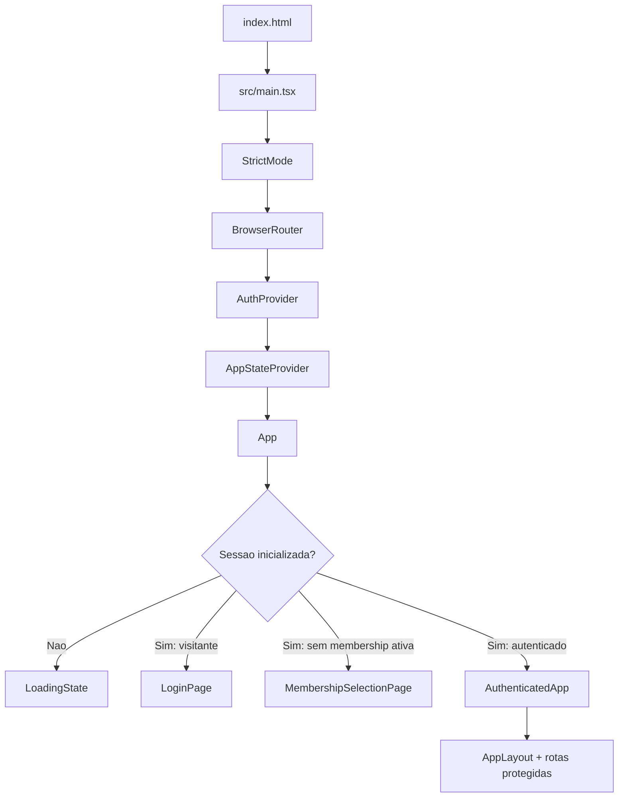

# Arquitetura do Frontend

Este documento descreve a arquitetura atualmente implementada no frontend do Gerenciador de Rotinas. O foco e explicar a organizacao do codigo, o fluxo da aplicacao, as responsabilidades de cada camada e os contratos usados pela interface.

Detalhes de backend, endpoints, banco de dados, regras internas da API e o conteudo de `openapi.yml` nao fazem parte deste documento.

## 1. Visao geral

O projeto e uma SPA (Single Page Application) construida com React e TypeScript. O Vite fornece o servidor de desenvolvimento e o build, enquanto o React Router controla a navegacao client-side.

### Stack declarada

- React 19 e React DOM.
- React Router 8.3.0.
- TypeScript em modo estrito.
- Vite 8.
- Tailwind CSS 4, integrado pelo plugin do Vite.
- Vitest com `happy-dom` para testes.
- ESLint, `typescript-eslint`, React Hooks e React Refresh.
- Prettier para formatacao.

### Principios observados

- Componentes de apresentacao ficam agrupados por dominio de produto.
- Estado global e restrito a autenticacao e preferencias/contexto da aplicacao.
- A carga operacional e exposta por um hook especializado (`useRoutineControl`).
- A comunicacao externa e centralizada em servicos e em um cliente HTTP comum.
- Tipos de dominio, constantes e funcoes puras ficam separados da camada visual.
- A planilha operacional e o centro da experiencia, com listas e agenda como formas alternativas de navegacao.

## 2. Fluxo de inicializacao



### Entry points

- `index.html` fornece o elemento DOM `#root`.
- `src/main.tsx` cria a raiz React e monta os providers na seguinte ordem:
  `StrictMode` -> `BrowserRouter` -> `AuthProvider` -> `AppStateProvider` -> `App`.
- `src/App.tsx` decide qual fluxo renderizar e concentra a composicao das rotas e da operacao autenticada.

## 3. Fluxo de autenticacao e acesso

`App` possui tres estados principais:

1. Enquanto a sessao e restaurada, exibe `LoadingState`.
2. Sem sessao, permite apenas `/login` e redireciona outras localizacoes para `LoginPage`, preservando a rota solicitada.
3. Com sessao, mas sem associacao ativa, exibe `MembershipSelectionPage`.
4. Com sessao e associacao ativa, renderiza `AuthenticatedApp`.

`AuthProvider` (`src/contexts/AuthContext.tsx`):

- inicializa e restaura a sessao;
- executa login e logout;
- seleciona a associacao ativa;
- atualiza a sessao;
- fornece usuario, memberships, associacao ativa, estado de carregamento e erros.

`RequirePermission` e `src/utils/permissions.ts` protegem trechos de navegacao e telas administrativas. As permissoes sao representadas por `APP_PERMISSION`, papeis organizacionais e acessos departamentais.

## 4. Roteamento

As constantes de rota ficam em `src/constants/routes.ts`. As rotas autenticadas sao renderizadas dentro de `AppLayout` usando `Outlet`.

| Rota                        | Tela                           | Situacao               |
| --------------------------- | ------------------------------ | ---------------------- |
| `/login`                    | `LoginPage`                    | Publica                |
| `/`                         | `HomePage`                     | Operacional            |
| `/planilha`                 | `SpreadsheetPage`              | Operacional            |
| `/agenda`                   | `AgendaPage`                   | Operacional            |
| `/lista`                    | `ListPage`                     | Operacional            |
| `/tarefas-fiscal`           | `TasksPage`                    | Operacional            |
| `/minhas-tarefas`           | `MyTasksPage`                  | Operacional            |
| `/perfil`                   | `ProfilePage`                  | Usuario                |
| `/empresas`                 | `CompaniesPage`                | Entidade               |
| `/empresas/nova`            | `CreateCompanyPage`            | Entidade/admin         |
| `/empresas/:clientId`       | `EntityDetailPage`             | Entidade               |
| `/rotinas`                  | `RoutinesPage`                 | Entidade/admin         |
| `/rotinas/nova`             | `CreateRoutinePage`            | Entidade/admin         |
| `/rotinas/:routineId`       | `EntityDetailPage`             | Entidade               |
| `/equipe`                   | `EmployeesPage`                | Admin                  |
| `/equipe/novo`              | `CreateEmployeePage`           | Admin                  |
| `/telas`                    | `ScreensPage`                  | Admin                  |
| `/telas/nova`               | `CreateScreenPage`             | Admin                  |
| `/configuracoes`            | `SettingsPage`                 | Admin                  |
| `/configuracoes/arquivados` | `ArchivedEntitiesSettingsPage` | Admin                  |
| `/dashboard-departamento`   | `PlaceholderPage`              | Estrutural/placeholder |
| `/dashboard-geral`          | `PlaceholderPage`              | Estrutural/placeholder |
| `/cargos`                   | `PlaceholderPage`              | Estrutural/placeholder |

Na interface, as rotas da equipe usam **`/equipe`** e **`/equipe/novo`**. Os caminhos antigos
`/funcionarios` e `/funcionarios/novo` são somente redirecionamentos de compatibilidade. A área
**Arquivados** reúne, em abas, empresas e rotinas; restaurar não reabre vínculos encerrados.

O detalhe de tarefa nao possui rota propria: `AuthenticatedApp` controla a tarefa selecionada e abre `RoutineDetailsCard` em um overlay. O mesmo componente tambem concentra o comportamento de foco, teclado e retorno de foco do dialogo.

## 5. Layout e navegacao

Os componentes de layout ficam em `src/layouts`:

- `AppLayout.tsx`: shell autenticado, area principal, sidebar responsiva, skip link, drawer mobile e persistencia do estado recolhido.
- `Sidebar.tsx`: navegacao principal, workspaces derivados das telas, agendas, listas e itens condicionais por perfil.
- `Topbar.tsx`: competencia atual, navegacao entre competencias, usuario e abertura do menu mobile.
- `WorkspaceBar.tsx`: cabecalho reutilizavel de pagina, contexto, metadados e acoes.

O layout recebe os dados operacionais carregados pelo fluxo autenticado e transforma esses dados em itens de navegacao para planilhas e agendas.

## 6. Paginas e componentes

### Paginas

As telas ficam em `src/pages` e representam entradas de navegacao. As paginas de operacao exibem dados e filtros; as paginas de criacao usam os componentes de formulario; telas ainda nao implementadas usam `PlaceholderPage`.

- Operacao: `HomePage`, `SpreadsheetPage`, `AgendaPage`, `ListPage`, `TasksPage`, `MyTasksPage`.
- Entidades: `CompaniesPage`, `EntityDetailPage`, `RoutinesPage`, `EmployeesPage`, `ScreensPage`.
- Criacao: `CreateCompanyPage`, `CreateRoutinePage`, `CreateEmployeePage`, `CreateScreenPage`.
- Conta e acesso: `LoginPage`, `MembershipSelectionPage`, `ProfilePage`, `SettingsPage`.
- Estrutura temporaria: `PlaceholderPage`.

### Componentes por dominio

- `components/ui`: primitivas visuais como `Button`, `IconButton`, `Card`, `Badge`, `Select`, `TextField` e `Textarea`.
- `components/common`: estados comuns de carregamento, erro e vazio.
- `components/auth`: protecao de permissao.
- `components/forms`: shell, secoes, progresso, acoes e feedback de formularios.
- `components/home`: resumo coletivo da competencia, prioridades e progresso por departamento.
- `components/catalog`: listas reutilizaveis de entidades.
- `components/entities`: edicao de entidades e gestao dos vinculos diretos entre empresa e rotina.
- `components/context-menu`: menus contextuais de empresa e tarefa.
- `components/routine-control`: dominio principal da operacao de rotinas.
  - `spreadsheet`: tabela, navegacao de telas e estados de aplicabilidade/fechamento.
  - `list`: secoes, comparacao, execucao, acoes rapidas, notas e cards de tarefas.
  - `details`: detalhe de tarefa, links e utilitarios do detalhe.
  - `shared`: status, campos editaveis e acoes reutilizaveis.
  - `forms`: modal de criacao de tarefa avulsa.

## 7. Estado, hooks e fluxo de dados

### Estado global

`AppStateProvider` (`src/contexts/AppStateContext.tsx`) fornece:

- competencia selecionada e sua formatacao;
- navegacao para competencia anterior e proxima;
- preferencias de tema, densidade e visualizacao padrao;
- usuario derivado do contexto de autenticacao.

As preferencias atualizam `data-theme` e `data-density` no elemento `html`.

### Hooks

- `useAuth`: acesso tipado ao contexto de autenticacao.
- `useAppState`: acesso ao estado global da aplicacao.
- `useRoutineControl`: carrega o agregado operacional, controla loading/erro/reload e permite atualizacoes locais.
- `useRoutineListView`: controla filtros e modo da lista operacional.
- `useOrganizationMembers`: consulta e gerencia colaboradores para fluxos de organizacao.
- `useCompetence`: regras e estado de competencia.
- `useFormState`: estado comum de formularios.

### Agregado operacional

O tipo `RoutineControlResponse`, em `src/types/domain.ts`, representa o agregado usado pela experiencia operacional:

- departamentos;
- empresas/clientes;
- rotinas;
- equipe (colaboradores);
- telas;
- projecoes de planilha;
- tarefas.

`AuthenticatedApp` deriva desse agregado a selecao de tela, departamento, itens de navegacao e contexto da planilha. As paginas e componentes recebem os dados e callbacks necessarios para renderizacao e mutacoes.

## 8. Camada de servicos

Os servicos ficam em `src/services`. Eles encapsulam operacoes por recurso e retornam dados tipados para hooks, contextos e paginas.

- `authService.ts`: sessao, login, logout, memberships e acesso.
- `routineControlService.ts`: agregado operacional, paginacao e normalizacao dos dados de controle de rotina.
- `taskService.ts`: leitura e mutacoes de tarefas agendadas e avulsas.
- `companyService.ts`: empresas e seus vinculos diretos de rotina.
- `routineService.ts`: rotinas e ciclo de vida de suas versoes.
- `screenService.ts`: telas, composicao e projecoes.
- `departmentService.ts`: departamentos e responsaveis disponiveis.
- `organizationMemberService.ts`: colaboradores, convites e acessos departamentais.
- `competenceService.ts`: consulta, criacao projetada e finalizacao de competencias.

### Cliente HTTP

`src/services/httpClient.ts` fornece a fronteira comum de transporte:

- usa `fetch` com `credentials: include`;
- resolve a URL base por `VITE_API_URL`;
- adiciona identificador de requisicao;
- suporta query parameters, JSON, abort signal e headers condicionais;
- gerencia CSRF para operacoes de escrita;
- suporta `If-Match` e `Idempotency-Key`;
- diferencia `ApiError` de `ApiNetworkError`;
- normaliza respostas de erro no formato `ProblemDetails`;
- preserva `X-Request-ID` e `Retry-After` nas falhas retornadas pela API.

Os servicos aceitam um cliente injetavel para facilitar testes, e a aplicacao tambem expoe instancias compartilhadas baseadas no cliente HTTP comum.

### Apresentacao de erros

`src/utils/apiErrors.ts` transforma `ProblemDetails.errors` em mensagens de interface. O utilitario aceita arrays, objetos aninhados e erros gerais (`nonFieldErrors`), prioriza essas mensagens sobre `detail` e usa `title` como fallback. Status de conflito, concorrencia, limite e indisponibilidade recebem orientacoes de recuperacao; corpos de erros `5xx` nao sao exibidos. Estados de erro que precisam de suporte podem mostrar o `X-Request-ID` preservado.

## 9. Tipos, constantes e utilitarios

### Tipos

- `src/types/domain.ts`: entidades, usuario, papeis, status, tarefas, ocorrencias, projecoes, filtros e preferencias.
- `src/types/navigation.ts`: estruturas de navegacao para planilhas e agendas.

### Constantes

- `routes.ts`: caminhos de navegacao.
- `roles.ts`: papeis e acessos.
- `routineStatus.ts`: configuracao visual e semantica dos status.
- `entityOptions.ts`: opcoes de entidades e formularios.
- `designTokens.ts`: classes e tokens semanticos usados pela interface.

### Utilitarios

`src/utils` concentra regras puras e transformacoes:

- competencia: `competence`;
- autorizacao: `permissions`;
- filtros e itens de lista: `routineFilters`, `routineListItems`;
- navegacao: `spreadsheetNavigation`, `routineControlScope`;
- normalizacao: `normalizeRoutineData`, `normalizeSearch`;
- relacoes: `routineRelations`;
- agenda e recorrencia: `routineSchedule`;
- links e clipboard: `taskLinks`, `clientClipboard`;
- apresentacao segura de erros HTTP: `apiErrors`;
- visao da home: `homeOverview`.

## 10. Estilos e design system

- `src/styles/index.css` importa Tailwind e temas, define o reset base e contem estilos especificos de navegacao, foco, responsividade e reduced motion.
- `src/styles/themes.css` define variaveis CSS para os temas `light`, `dark` e `jaral`, incluindo cores de superficie, controles, tabelas, listas, estados e sombras.
- `src/constants/designTokens.ts` centraliza classes semanticas para shell, paineis, textos, controles, botoes, foco e status.

A densidade (`compact` ou `comfortable`) e o tema sao aplicados em runtime por atributos no elemento raiz. A interface tambem possui comportamento responsivo para sidebar, navegacao de telas e controles operacionais.

## 11. Testes

Os testes usam Vitest e `happy-dom`. A cobertura existente inclui:

- servicos: `authService.test.ts`, `routineControlService.test.ts`, `writeServices.test.ts`;
- contexto e layout: `AppStateContext.test.tsx`, `Topbar.test.tsx`;
- autorizacao e menus: `RequirePermission.test.tsx`, `TaskContextMenu.test.tsx`;
- operacao de rotinas: testes de detalhe, links, comparacao, acoes e estados de aplicabilidade;
- regras puras: competencia, permissoes, filtros e recorrencia.

O foco atual esta em regras, transformacoes, servicos, autorizacao e componentes operacionais. Nao ha evidencia de uma suite end-to-end ou de cobertura ampla de paginas completas.

## 12. Build e execucao

Scripts principais definidos em `package.json`:

| Comando                | Funcao                             |
| ---------------------- | ---------------------------------- |
| `npm run dev`          | Servidor de desenvolvimento Vite   |
| `npm run build`        | Build de producao em `dist/`       |
| `npm run preview`      | Servir localmente o build          |
| `npm run typecheck`    | Verificacao TypeScript sem emissao |
| `npm run lint`         | Verificacao ESLint                 |
| `npm run test`         | Execucao dos testes Vitest         |
| `npm run format:check` | Validacao de formatacao            |

`vite.config.ts` registra os plugins React e Tailwind. O projeto nao configura aliases, lazy loading ou divisao manual de chunks.

Para ambiente de build, `VITE_API_URL` precisa estar definida antes da criacao das instancias de servico. O Docker usa um build multi-stage: Vite/Node no desenvolvimento e arquivos estaticos servidos por Nginx em producao. O deploy na Vercel usa `dist/` e rewrite para `index.html`, necessario para as rotas client-side.

## 13. Pontos de acoplamento e evolucao

- `App.tsx` e o maior orquestrador: combina autenticacao, rotas, carregamento operacional, mutacoes de tarefas, criacao de entidades, navegacao contextual e overlay de detalhe.
- Algumas paginas importam servicos diretamente, enquanto outras recebem dados e callbacks de `App.tsx`; a fronteira entre pagina, hook e orquestrador ainda nao e uniforme.
- Dashboards e cargos possuem estrutura de rota, mas ainda sao placeholders.
- A competencia inicial em `AppStateContext.tsx` e fixa em `2026-06`; isso deve ser confirmado como regra ou fixture.
- Nao existe roteamento lazy nem evidencia de testes end-to-end, acessibilidade automatizada ou validacao visual.

Uma evolucao natural seria extrair do `App.tsx` os fluxos de mutacao e selecao contextual em hooks ou controladores menores, preservando a separacao entre servicos, estado e apresentacao.

## 14. Estrutura resumida

```text
src/
|-- main.tsx                  # montagem da aplicacao
|-- App.tsx                   # orquestracao e rotas
|-- contexts/                 # autenticacao e estado global
|-- hooks/                    # casos de uso e estado local reutilizavel
|-- layouts/                  # shell, sidebar, topbar e workspace
|-- pages/                    # telas e entradas de navegacao
|-- components/
|   |-- ui/                   # primitivas visuais
|   |-- common/               # loading, erro e vazio
|   |-- auth/                 # autorizacao visual
|   |-- forms/                # infraestrutura de formularios
|   |-- home/                 # blocos da home
|   |-- entities/             # entidades e edicao
|   |-- catalog/              # listas de catalogo
|   |-- context-menu/         # menus contextuais
|   `-- routine-control/      # planilha, listas, detalhes e tarefas
|-- services/                 # transporte e servicos por recurso
|-- types/                    # contratos de dominio e navegacao
|-- constants/                # rotas, papeis, status e tokens
|-- utils/                    # regras puras e adaptadores de dados
|-- styles/                   # Tailwind, temas e CSS global
`-- assets/                   # arquivos estaticos
```
